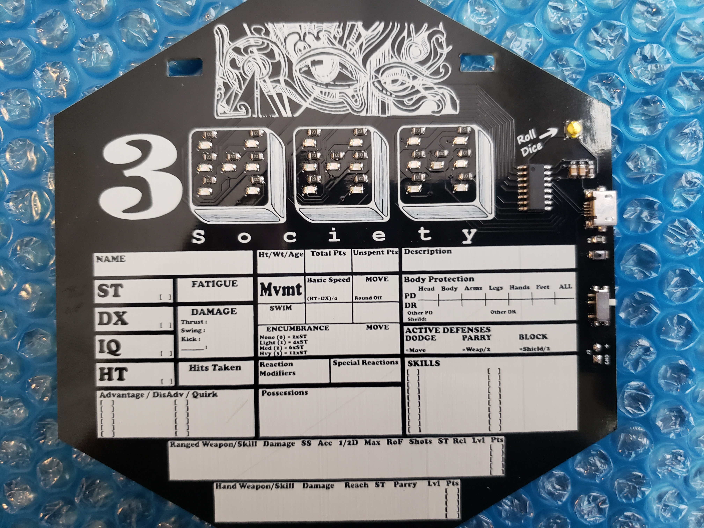
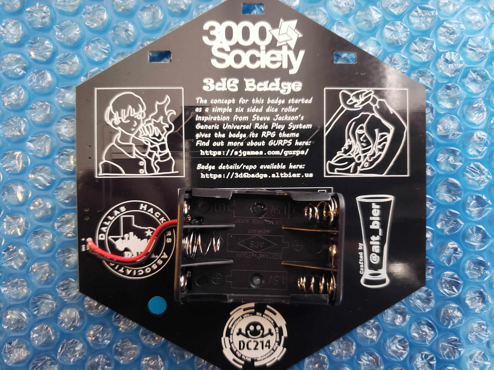

# 3d6 Badge Kit

The 3d6 badge kit that I am distributing contains the following items:

*  A fully assembled badge with attached battery holder
*  A Lanyard
*  3xAAA Batteries
*  A pencil with clip (for attaching to the lanyard)
*  Stickers

## Badge LED Colors

The majority of the badges I have created have Blue LEDs on them.

However, I have made limited numbers of badges with other LED colors including Red, and Pink as well as some multi-colored badges (one color per die) such as Red-White-Blue.

## Lanyard

There are several styles of lanyards since I did multiple lanyard runs.

These lanyards were randomly distributed in the kits.
So, you may get one with plastic clips or metal clips or large block lettering or small logo lettering.

They all function the same.

## Batteries

The batteries provided are a standard AAA non-rechargeable type.

Given the small power draw of the badge the provided batteries should last for the entire DEFCON conference (4+ days).

These can be replaced with any off the shelf AAA batteries.  

## Pencil with clip

The pencil provided is a small golf type pencil with an eraser.
It has had a clip added to it that allows for it to be attached to the lanyard.

Care should be taken to attach it securely or risk having it fall off into the void.
I would suggest attaching it into the small sewn gap holding a lanyard clip.

## Stickers

The kit contains two stickers.
The first is a new creation using the DEFCON 29 theme colors on a black background.
The second is from last years BSidesDFW Hardware Hacking Village

## Thanks

Thank You for your interest in my badge.

-- [@alt_bier](https://twitter.com/alt_bier)  - [My Contact Info](https://gowen.net/about)
