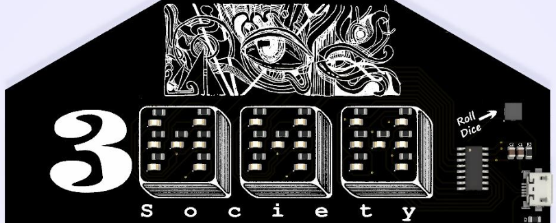

# 3d6 Badge

Welcome to the 3d6 Badge website.

This is where you will find information about the 3d6 badge and its repository.

-- [@alt_bier](https://twitter.com/alt_bier)  - [My Contact Info](https://gowen.net/about)

---

# Concept

The concept for this badge started as a simple six sided dice roller.
It was originally just going to have two dice on it and be quite small.
But, then after discussions in the 3000 Society gaming group inspiration hit.
If we added a 3rd die the resulting 3d6 layout would be perfect for GURPS.
And thus the concept changed and the badge expanded into the GURPS player character sheet you see here.

For those not familiar with GURPS: it is the Generic Universal Role Play System developed by Steve Jackson.
You can get more information about it here: https://sjgames.com/gurps/

# Badge Kit

If you are looking for what comes in the badge kit, those details are here: [3d6 Badge Kit](badgekit.md)

# Badge Details

The details of the badge including the PCB design files and firmware and artwork are all included in this repository.

We will outline some of those details here.

## Silkscreen

The silkscreen on the front of the badge contains the GURPS player character sheet blocks (that can be written on with the included clip on pencil), the dice outlines which make up the 3000 Society logo, and a cool looking block of art at the top.

The top art block was created by my son.  I asked him to create something cool that was reminiscent of the small art blocks used as section headings in old school D&D adventure modules.
What he came up with was spectacular and captured that RPG module essence.

The silkscreen on the back of the badge contains several logos and links as well as two character portraits as one might find on an RPG character sheet.

The art for the character portraits were created by my daughter.  I asked her to create portraits of a generic magic user and melee class.  The limitations of the silkscreen media (e.g. no shading, line separation, etc.) meant she could not provide the usual detail she does with the portraits she creates for our family RPG characters.
Despite this challenge the end result is awesome and really brings the character sheet badge concept to life.

The art used for the silkscreen is available in the [art directory](https://github.com/gowenrw/3d6_badge/tree/main/art) of this repository.

## Dice

The dice are each made up of seven LEDs arraigned to be able to lite up one through six with the look of a standard six sided die.
These LEDs are grouped into three pairs and a single so that each die requires only 4 microcontroller pins to control.

With the expansion from two to three dice the required pins went from eight to twelve, maxing out the microcontroller I chose for the badge.
With no remaining pins for a button to roll the dice I had to use the chip reset pin for this function.  So, hitting the 'Roll Dice' button is the same a powering it off and on again.

## Microcontroller

The microcontroller I chose for this badge is the CH552G IC that I have used on several other badges.  It is usually inexpensive and simple to use.

The chip shortage impacted price and availability of the CH552G.  
However, even with the higher price it was still a cheaper option than the other ICs out there.

If you want more detail about the CH552G chip I put together a video about it here:
[Intro to the CH552G Microcontroller](https://www.youtube.com/watch?v=EKhntUyfqhQ&lc=Ugyt9iKp8tLhYibYOgh4AaABAg)

The firmware for the badge and the header files for working with the CH552G are available in the [code directory](https://github.com/gowenrw/3d6_badge/tree/main/code) of this repository.

## EDA

The electronic design automation program used for this badge is KiCad.

I took great care to include and use local library files for all the schematic objects, footprints, and 3d models used in this badge.  
This way you don't have to worry about not having a file that KiCad depreciates at some point in the future.

All of the EDA files including the Gerber output files I used to have the badge manufactured are available in the [eda directory](https://github.com/gowenrw/3d6_badge/tree/main/eda) of this repository.
